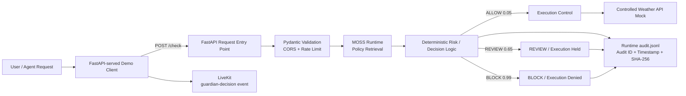

# GUARDIAN — Current Architecture

This document is the evidence-aligned architecture for the repository on `main`.

## Architecture flow

## Critical request path

`Request → FastAPI → validation/security controls → MOSS policy retrieval → deterministic decision → execution control → audit`

The browser demo client separately publishes the resulting decision event to LiveKit.

## MOSS boundary

The application uses the official Python `moss` SDK when these server-side environment variables are configured:

- `MOSS_PROJECT_ID`
- `MOSS_PROJECT_KEY`
- `MOSS_INDEX_NAME`

The backend loads the configured index and queries it for policy context. The query result's `time_taken_ms` is exposed as the MOSS retrieval measurement.

The 7ms shown in earlier demo evidence is not hard-coded by the current implementation. A configured MOSS index supplies the runtime measurement. Application end-to-end latency is not claimed.

When `MOSS_DEMO_FALLBACK=true` is explicitly enabled for local testing, the response is labeled `DEMO_FALLBACK`; it is not presented as live MOSS.

## Deterministic enforcement states

- `0.05 → ALLOW`: the controlled local Weather API mock may execute.
- `0.65 → REVIEW`: execution is disabled and the response reports `PENDING_HUMAN_APPROVAL`.
- `0.99 → BLOCK`: execution is disabled.
- MOSS policy retrieval failure: `FAIL_CLOSED` → `BLOCK` with `executed=false`.

## Security controls

- Pydantic query validation: 1–2000 characters.
- Restricted CORS to the deployed origin.
- Configurable rate limiting with optional Redis backend and bounded in-process fallback.
- Fail-closed behavior on MOSS retrieval failure.
- Request-level Audit ID and SHA-256 event hash.
- REVIEW and BLOCK paths prevent controlled tool execution.

## Audit boundary

Each decision is appended to the runtime `audit.jsonl` file and also emitted through application logging.

The audit record contains request/decision metadata, timestamp, MOSS mode/latency, execution status, reason, Audit ID, and SHA-256 hash.

This is runtime prototype storage. It is not represented as durable external compliance storage or an immutable ledger.

## LiveKit boundary

The FastAPI-served browser demo uses the LiveKit browser SDK and publishes a `guardian-decision` data event containing the Guardian decision, risk score, Audit ID, and timestamp.

This is a real-time decision-event demonstration. The repository does not claim a production governance dashboard.

## Engineering verification

The repository includes automated tests for request validation, all three decision states, MOSS fail-closed behavior, audit hashing, rate limiting, the compatibility route, and explicit latency semantics.

GitHub Actions currently runs the test suite on pushes and pull requests.

## Future / not claimed as current

- Production authentication and authorization.
- Durable external audit storage.
- Fully implemented human approval queue/workflow.
- Live external Weather API execution.
- Universal gating for arbitrary tools.
- Continuous evaluation/monitoring beyond the demonstrated controls.
