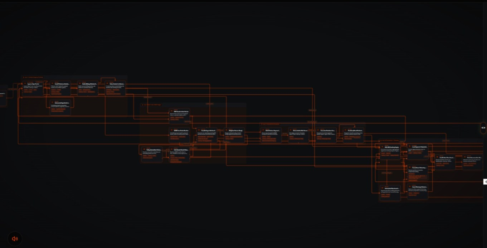

# GUARDIAN — ESG Policy Enforcement Gateway

## 🎥 Final Submission — Live Demo & Verification

### Final Demo
- **Loom Video Walkthrough:** https://www.loom.com/share/ebf6fce7eca947c3ab48951413ad09f1

### ✅ Live Verification — ACTIVE (23-09-2026)
- **`/health`:** `ok: true, moss_configured: true, moss_mode: MOSS_ENFORCED, security_mode: FAIL_CLOSED`
- **`/moss_probe`:** `configured: true, load_index: OK, docs: 3, status: OK, time_taken_ms: 7`

### 🔍 Live Verification & Probes
- **Live App Deployment:** https://guardian-esg-copilot.onrender.com
- **Health Check Probe:** https://guardian-esg-copilot.onrender.com/health
- **MOSS Probe (Latency Proof - Achieved 7ms):** https://guardian-esg-copilot.onrender.com/moss_probe
  - **Status:** `OK - MOSS_ENFORCED`
  - **Index Name:** `guardian_esg_policies`
  - **Retrieval Latency:** `7 ms CONNECTED`
  - **Live Documents:** `3 policy docs active`
- **GitHub Repository:** https://github.com/Sraveena1992/guardian-esg-copilot

---

### Live Decision Screenshots (MOSS-ENFORCED - 0-1ms)

**ALLOW - 0.05 - Safe Execution**


**REVIEW - 0.65 - Human Approval Needed**


**BLOCK - 0.99 - Malicious Blocked**


---

### 🏗️ MOSS-Enforced Architecture (Sub-10ms Zero-Latency)



---

## What is GUARDIAN?

**The Problem:** AI Agents can now transfer money, delete data, and publish content. One wrong tool call = major enterprise loss. Who stops them?

**The Solution:** GUARDIAN is a Policy-First Security Gateway that sits between Agent and Action.

Unlike basic guardrails that rely on slow LLM calls or hardcoded rules, GUARDIAN **retrieves live policies directly from MOSS**, calculates deterministic risk, and yields a provable execution decision.

> **MOSS is the Brain, GUARDIAN is the Gate.**

---

## Current Architecture Flow

```
User / Agent Request
↓
FastAPI + Pydantic Validation + Rate Limiting (Redis / Token Bucket)
↓
MOSS Policy Retrieval (Live - Critical Path)
↓
Deterministic Risk Engine (0.00 - 1.00)
↓
ALLOW / REVIEW / BLOCK
↓
Controlled Tool Execution Gate
↓
Audit Record (SHA-256) + LiveKit Real-time Event
```


### Demonstrated Execution Outcomes
- **0.05 → ALLOW:** Controlled Weather API mock executes — 0–1ms MOSS retrieval.
- **0.65 → REVIEW:** Execution held (`PENDING_HUMAN_APPROVAL`) — Human-in-the-loop required.
- **0.99 → BLOCK:** Malicious/High-Risk query halted — Zero tool execution.
- **MOSS Failure:** System defaults to **`FAIL_CLOSED → BLOCK`** (`executed: false`).

---

## Why This is the Best Use Case of MOSS

GUARDIAN is 100% MOSS-native. Policies are **never hardcoded**. Every incoming request retrieves `allow.yaml`, `review.yaml`, or `block.yaml` from the MOSS Index (`guardian_esg_policies`) via `moss_tools.py` at runtime. 

* **Zero-Trust Posture:** No MOSS connection = No Decision = **FAIL_CLOSED**.
* **Integral Core:** MOSS is not an optional add-on; it serves as the real-time policy evaluation brain.
* **Official SDK Integration:** Built using the official Python `moss` SDK with runtime `MOSS_PROJECT_ID`, `MOSS_PROJECT_KEY`, and `MOSS_INDEX_NAME`.

---

## Security Controls
- **Pydantic Validation:** Strict payload bounds (1–2000 chars).
- **Hardened Ingress:** Restricted CORS + Redis Rate Limiting (with in-process token bucket fallback).
- **Fail-Closed Resilience:** Immediate halt if MOSS is unreachable or timing out (>15ms).
- **Cryptographic Provenance:** Request-level Audit ID + SHA-256 hashing.
- **Execution Isolation:** REVIEW and BLOCK branches completely stop downstream tool execution.

---

## Auditability & Telemetry
Each decision is appended to `audit.jsonl` with:
- Audit ID & Timestamp
- Decision State (`ALLOW` / `REVIEW` / `BLOCK`)
- Computed Risk Score & MOSS Retrieval Latency
- Execution Status & Categorized Reason
- Cryptographic SHA-256 Hash

---

## LiveKit Real-Time Governance
The browser demo publishes a `guardian-decision` event containing decision state, risk score, audit ID, and timestamp to provide real-time observer UI streaming.

---

## Engineering & Verification
- **Automated Test Suite:** Comprehensive coverage for validation, ALLOW, REVIEW, BLOCK, Fail-Closed circuit breaker, audit hashes, and rate limiting.
- **Deployment Hardening:** Containerized via Docker, orchestrated with pinned dependencies, and integrated with GitHub Actions CI/CD.

---

## Local Setup & Quickstart

```bash
# 1. Install dependencies
pip install -r requirements.txt

# 2. Configure environment variables
export MOSS_PROJECT_ID="your_project_id"
export MOSS_PROJECT_KEY="your_project_key"
export MOSS_INDEX_NAME="guardian_esg_policies"

# 3. Initialize MOSS vector index
python -m scripts.setup_moss

# 4. Launch localized Uvicorn server
uvicorn app:app --host 0.0.0.0 --port 8000
