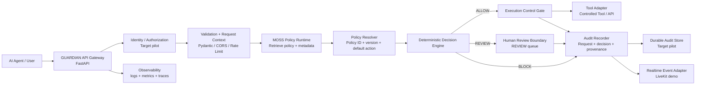

# GUARDIAN — Pilot Target Architecture (V2)

This document defines the target pilot architecture for GUARDIAN while preserving a strict separation between implemented evidence and future production capability.

## 1. Product boundary

GUARDIAN is an enforcement gateway positioned between an AI agent and an action/tool boundary.

The gateway has one invariant:

**No protected action executes until policy retrieval and deterministic enforcement complete successfully.**

## 2. Target pilot architecture



### Current implementation boundary

The deployed repository currently demonstrates:

- FastAPI request entry.
- Pydantic validation.
- Restricted CORS.
- Configurable rate limiting.
- MOSS runtime retrieval when configured.
- Deterministic ALLOW / REVIEW / BLOCK enforcement.
- Controlled Weather API mock.
- Fail-closed behavior when policy retrieval fails.
- Runtime `audit.jsonl` with Audit ID, timestamp, decision, risk and SHA-256 hash.
- Browser-side LiveKit decision-event publishing.

### Target pilot additions

These should be treated as pilot/production extensions until independently implemented and tested:

- Authentication and authorization with least-privilege tool scopes.
- Durable external audit storage.
- A real human approval queue for REVIEW.
- Tool-specific adapters with explicit allowlists and idempotency.
- Centralized metrics/tracing and alerting.
- Policy versioning and deployment controls.
- Stronger tenant isolation for multi-tenant deployments.

## 3. Critical request path

1. Receive request.
2. Validate size and shape.
3. Establish request identity and correlation ID.
4. Retrieve policy context from MOSS.
5. Resolve the retrieved policy's identity, version, and action metadata.
6. Apply deterministic safety overrides for clearly dangerous patterns.
7. Produce one explicit enforcement state: ALLOW, REVIEW, or BLOCK.
8. Pass ALLOW only through the execution gate.
9. Hold REVIEW before execution.
10. Deny BLOCK before execution.
11. Record the outcome with policy provenance.
12. Publish a non-blocking real-time decision event.

## 4. Fail-closed contract

Any failure in a required policy step must result in:

`decision=BLOCK`

`executed=false`

The failure must be recorded with an audit identifier and reason.

This includes missing credentials, unavailable policy index, empty policy result, malformed policy metadata, or policy query failure.

## 5. Policy contract

Every policy document used by the enforcement engine should expose at least:

```json
{
  "id": "policy-id",
  "text": "human-readable policy",
  "metadata": {
    "policy": "POLICY_NAME",
    "default_action": "ALLOW|REVIEW|BLOCK"
  }
}
```

The enforcement layer should retain the selected policy ID and action source in the audit record.

## 6. Decision contract

```
ALLOW  -> risk 0.05 -> execution may proceed
REVIEW -> risk 0.65 -> execution held
BLOCK  -> risk 0.99 -> execution denied
```

These are the project's demonstrated decision mappings, not a universal ESG risk standard.

## 7. Security design principles

- Security decision precedes tool execution.
- Policy retrieval is mandatory on the protected path.
- Local dangerous-pattern checks act only as defense-in-depth overrides.
- Failures never silently downgrade into ALLOW.
- Secrets remain server-side.
- Audit records include provenance and integrity evidence.
- Real-time event publishing is observational and must not determine the security decision.

## 8. Reliability and scale

For the pilot, the reliability strategy is:

- bounded request size;
- rate limiting;
- fail-closed policy retrieval;
- deterministic decision logic;
- explicit execution gate;
- structured audit events;
- automated tests and CI.

For production scale, add durable state, distributed rate limiting, idempotency keys, authentication/authorization, policy version controls, and externalized observability.

## 9. Judge-facing architecture story

**MOSS retrieves the applicable policy context; GUARDIAN turns that context into a deterministic enforcement decision; the execution gate is the hard security boundary.**

This separation is intentionally narrow: retrieval, decision, enforcement, audit, and realtime observation each have a defined responsibility.
